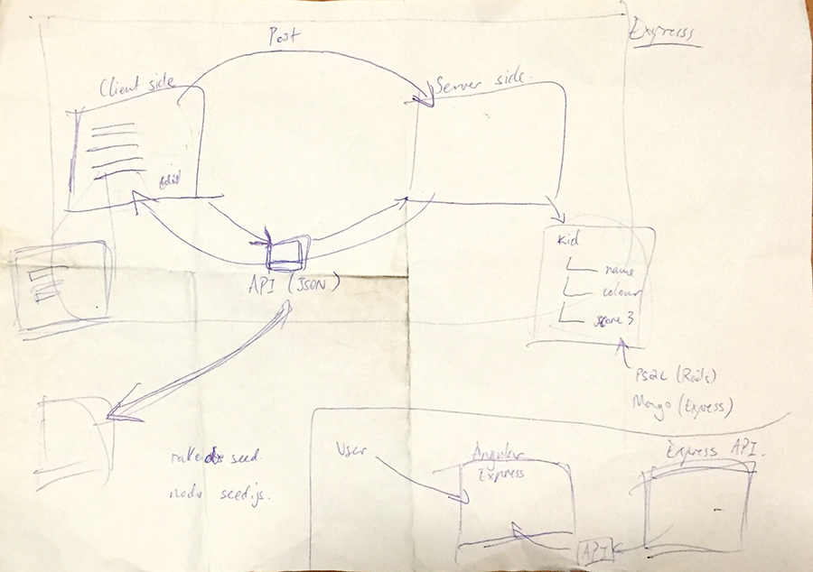
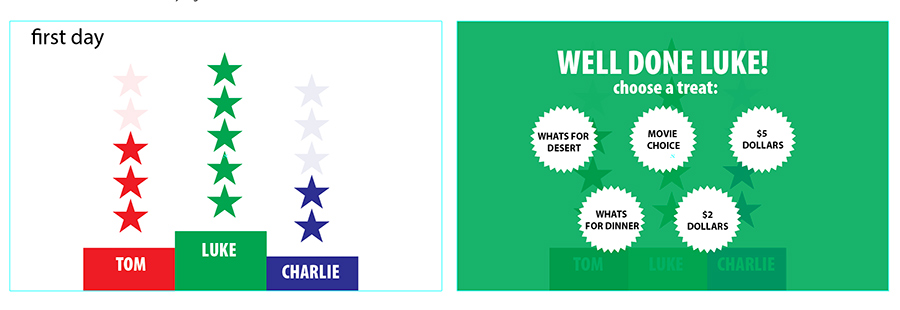

# BeGood - star chart 
###Encourage kids to contribute

Initial data flow sketches

Initial interface wireframe

## Explanation

Reward charts, or star charts, are a powerful way of encouraging good behaviour, such as cleaning teeth without fuss, discouraging behaviour you don’t want, such as hitting and rewarding your child for practising new skills, such as staying next to when in crowds or putting all the toys in a box when asked.

### Examples of printed charts:
- http://www.kidpointz.com/printable-charts/star-charts
- http://www.rewardcharts4kids.com/reward-charts-by-character

This application does away with the print outs and sticker boxes n stamps and provides a digital and dynamic way to reward stars to kids  aged 3-8yrs. Kids can add their own names and choose a favourite colour for there collection - stars are added with clicks to the base ‘pile of stars’ and removed by clicking on the stars themselves. There is a running tally of stars collected over a number of days (this function is still in development and is included as static DOM elements only) - instant rewards are trigger in the form of animations and sounds  as kids collect their.

For better communal visibly the site can be set as a desktop screen saver on the family computer - this can be done using the WebViewScreenSaver https://github.com/liquidx/webviewscreensaver

### Advantages over printed charts

- easy to use
- no printouts
- no printouts
- no sicker boxes or ink stamps
- accessible anywhere (mobile version in development)
- instant animated/sound rewards for stars collected (in development)

##Technologies Used

- NodeJS - an open-source, cross-platform runtime environment for developing server-side Web applications.
- ExpressJS -  A flexible Node.js web application framework that provides a robust set of features for web and mobile applications.
- jQuery - A fast, small, and feature-rich JavaScript library.
- Ajax - A set of web development techniques on the client-side to create asynchronous Web applications. Allows web applications to send and retrieve data from a server asynchronously without interfering with the display and behaviour of the existing page.
- MongoDB - A free and open-source cross-platform document-oriented database.
- Mongoose - A straight-forward, schema-based solution

## Improvements

This version of the project demonstrates the very first set of base functionality - plans are to extend as follows:

- add an (upto) 7 day star tally functionality
- a grand prise animation or access to a custom game
- add sounds!
- add additional ‘in-running’ prises i.e. - a random smily face instead of a star; a special animation triggered for a set number of stars collected
- themed chart options i.e. Superheroes, fairies, outerspace.
- an option to add specific chore tasks to tick off
- grouping stars in ‘bunches’ of fives as collected
- option for parent log in
- better interface responsiveness

