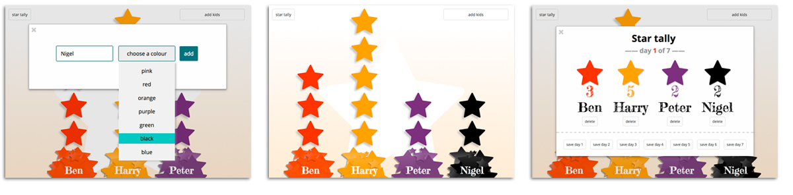

# BeGood - kids digital star chart

### App Description:
This application does away with the print outs and sticker boxes n stamps and provides a digital and dynamic way to reward stars to kids aged 3-8yrs.

### Functionality:
Kids can add their own names and choose a favourite colour for their collection - stars are added with clicks to the base ‘pile of stars’ and removed by clicking on the stars themselves. There is a running tally of stars collected over a number of days.

### Tools:
* Node.js, Express.js, MongoDB
* HTML5, jQuery, Ajax, CSS
* Font Awesome

### Extensions
* Rebuild with Angular.js
* Sounds!
* Graphical Theme options
* Parent login
* Animations trigger after 5 stars collected
